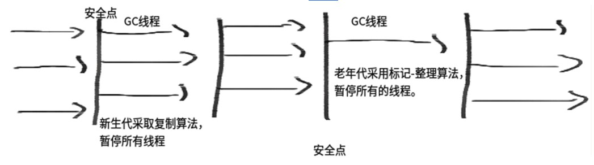
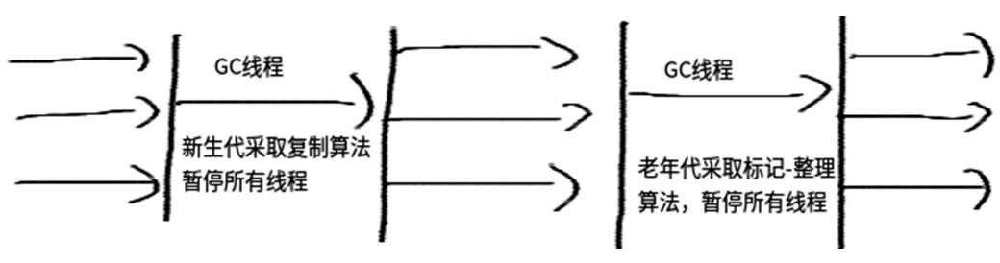

<!-- TOC -->

- [1. JVM优化](#1-JVM%E4%BC%98%E5%8C%96)
  - [1.1. JVM简单结构图](#11-JVM%E7%AE%80%E5%8D%95%E7%BB%93%E6%9E%84%E5%9B%BE)
    - [1.1.1. 类加载子系统与方法区：](#111-%E7%B1%BB%E5%8A%A0%E8%BD%BD%E5%AD%90%E7%B3%BB%E7%BB%9F%E4%B8%8E%E6%96%B9%E6%B3%95%E5%8C%BA)
  - [1.2. Java堆](#12-Java%E5%A0%86)
  - [1.3. 直接内存](#13-%E7%9B%B4%E6%8E%A5%E5%86%85%E5%AD%98)
  - [1.4. 垃圾回收系统](#14-%E5%9E%83%E5%9C%BE%E5%9B%9E%E6%94%B6%E7%B3%BB%E7%BB%9F)
  - [1.5. Java栈](#15-Java%E6%A0%88)
  - [1.6. 本地方法栈](#16-%E6%9C%AC%E5%9C%B0%E6%96%B9%E6%B3%95%E6%A0%88)
  - [1.7. PC寄存器](#17-PC%E5%AF%84%E5%AD%98%E5%99%A8)
  - [1.8. 执行引擎](#18-%E6%89%A7%E8%A1%8C%E5%BC%95%E6%93%8E)
- [2. 堆结构及对象分代](#2-%E5%A0%86%E7%BB%93%E6%9E%84%E5%8F%8A%E5%AF%B9%E8%B1%A1%E5%88%86%E4%BB%A3)
  - [2.1. 什么是分代，分代的必要性是什么](#21-%E4%BB%80%E4%B9%88%E6%98%AF%E5%88%86%E4%BB%A3%E5%88%86%E4%BB%A3%E7%9A%84%E5%BF%85%E8%A6%81%E6%80%A7%E6%98%AF%E4%BB%80%E4%B9%88)
  - [2.2. 分代的划分](#22-%E5%88%86%E4%BB%A3%E7%9A%84%E5%88%92%E5%88%86)
  - [2.3. 新生代（Young Generation）](#23-%E6%96%B0%E7%94%9F%E4%BB%A3Young-Generation)
    - [2.3.1. 老年代（Old Generationn）](#231-%E8%80%81%E5%B9%B4%E4%BB%A3Old-Generationn)
    - [2.3.2. 永久代（Permanent Generationn）](#232-%E6%B0%B8%E4%B9%85%E4%BB%A3Permanent-Generationn)
- [3. 垃圾回收算法及分代垃圾收集器](#3-%E5%9E%83%E5%9C%BE%E5%9B%9E%E6%94%B6%E7%AE%97%E6%B3%95%E5%8F%8A%E5%88%86%E4%BB%A3%E5%9E%83%E5%9C%BE%E6%94%B6%E9%9B%86%E5%99%A8)
  - [3.1. 垃圾收集器的分类](#31-%E5%9E%83%E5%9C%BE%E6%94%B6%E9%9B%86%E5%99%A8%E7%9A%84%E5%88%86%E7%B1%BB)
    - [3.1.1. 次收集器](#311-%E6%AC%A1%E6%94%B6%E9%9B%86%E5%99%A8)
    - [3.1.2. 全收集器](#312-%E5%85%A8%E6%94%B6%E9%9B%86%E5%99%A8)
    - [3.1.3. 垃圾回收器的常规匹配](#313-%E5%9E%83%E5%9C%BE%E5%9B%9E%E6%94%B6%E5%99%A8%E7%9A%84%E5%B8%B8%E8%A7%84%E5%8C%B9%E9%85%8D)
  - [3.2. 常见垃圾回收算法](#32-%E5%B8%B8%E8%A7%81%E5%9E%83%E5%9C%BE%E5%9B%9E%E6%94%B6%E7%AE%97%E6%B3%95)
    - [3.2.1. 引用计数（Reference Counting）](#321-%E5%BC%95%E7%94%A8%E8%AE%A1%E6%95%B0Reference-Counting)
    - [3.2.2. 复制（Copying）](#322-%E5%A4%8D%E5%88%B6Copying)
    - [3.2.3. 标记-清除（Mark-Sweep）](#323-%E6%A0%87%E8%AE%B0-%E6%B8%85%E9%99%A4Mark-Sweep)
    - [3.2.4. 标记-整理（Mark-Compact）](#324-%E6%A0%87%E8%AE%B0-%E6%95%B4%E7%90%86Mark-Compact)
    - [3.3	分代垃圾收集器](#33-%E5%88%86%E4%BB%A3%E5%9E%83%E5%9C%BE%E6%94%B6%E9%9B%86%E5%99%A8)
      - [3.3.1	串行收集器（Serial）](#331-%E4%B8%B2%E8%A1%8C%E6%94%B6%E9%9B%86%E5%99%A8Serial)
      - [3.3.2	并行收集器（ParNew）](#332-%E5%B9%B6%E8%A1%8C%E6%94%B6%E9%9B%86%E5%99%A8ParNew)
      - [3.3.3	Parallel Scavenge收集器](#333-Parallel-Scavenge%E6%94%B6%E9%9B%86%E5%99%A8)
      - [3.3.4	Serial Old收集器](#334-Serial-Old%E6%94%B6%E9%9B%86%E5%99%A8)
      - [3.3.5	Parallel Old收集器](#335-Parallel-Old%E6%94%B6%E9%9B%86%E5%99%A8)
      - [3.3.6	CMS收集器（Concurrent Mark Sweep）](#336-CMS%E6%94%B6%E9%9B%86%E5%99%A8Concurrent-Mark-Sweep)
      - [3.3.7	分区收集- G1收集器](#337-%E5%88%86%E5%8C%BA%E6%94%B6%E9%9B%86--G1%E6%94%B6%E9%9B%86%E5%99%A8)
  - [4	JVM优化](#4-JVM%E4%BC%98%E5%8C%96)
    - [4.1	JDK常用JVM优化相关命令](#41-JDK%E5%B8%B8%E7%94%A8JVM%E4%BC%98%E5%8C%96%E7%9B%B8%E5%85%B3%E5%91%BD%E4%BB%A4)
      - [4.1.1	jps](#411-jps)
      - [4.1.2	jstat](#412-jstat)
      - [4.1.3	jvisualvm](#413-jvisualvm)
      - [4.1.4	visualgc插件](#414-visualgc%E6%8F%92%E4%BB%B6)
    - [4.2	JVM常见参数](#42-JVM%E5%B8%B8%E8%A7%81%E5%8F%82%E6%95%B0)
      - [4.2.1	内存设置](#421-%E5%86%85%E5%AD%98%E8%AE%BE%E7%BD%AE)

<!-- /TOC -->

# 1. JVM优化
## 1.1. JVM简单结构图
### 1.1.1. 类加载子系统与方法区：

类加载子系统负责从文件系统或者网络中加载Class信息，加载的类信息存放于一块称为方法区的内存空间。除了类的信息外，方法区中可能还会存放运行时常量池信息，包括字符串字面量和数字常量（这部分常量信息是Class文件中常量池部分的内存映射）。
## 1.2. Java堆
java堆在虚拟机启动的时候建立，它是java程序最主要的内存工作区域。几乎所有的java对象实例都存放在java堆中。堆空间是所有线程共享的，这是一块与java应用密切相关的内存空间。
## 1.3. 直接内存
java的NIO库允许java程序使用直接内存。直接内存是在java堆外的、直接向系统申请的内存空间。通常访问直接内存的速度会优于java堆。因此出于性能的考虑，读写频繁的场合可能会考虑使用直接内存。由于直接内存在java堆外，因此它的大小不会直接受限于Xmx指定的最大堆大小，但是系统内存是有限的，java堆和直接内存的总和依然受限于操作系统能给出的最大内存。
## 1.4. 垃圾回收系统
垃圾回收系统是java虚拟机的重要组成部分，垃圾回收器可以对方法区、java堆和直接内存进行回收。其中，java堆是垃圾收集器的工作重点。和C/C++不同，java中所有的对象空间释放都是隐式的，也就是说，java中没有类似free()或者delete()这样的函数释放指定的内存区域。对于不再使用的垃圾对象，垃圾回收系统会在后台默默工作，默默查找、标识并释放垃圾对象，完成包括java堆、方法区和直接内存中的全自动化管理。
## 1.5. Java栈
每一个java虚拟机线程都有一个私有的java栈，一个线程的java栈在线程创建的时候被创建，java栈中保存着帧信息，java栈中保存着局部变量、方法参数，同时和java方法的调用、返回密切相关。
## 1.6. 本地方法栈
本地方法栈和java栈非常类似，最大的不同在于java栈用于方法的调用，而本地方法栈则用于本地方法的调用，作为对java虚拟机的重要扩展，java虚拟机允许java直接调用本地方法（通常使用C编写）
## 1.7. PC寄存器
PC（Program Counter）寄存器也是每一个线程私有的空间，java虚拟机会为每一个java线程创建PC寄存器。在任意时刻，一个java线程总是在执行一个方法，这个正在被执行的方法称为当前方法。如果当前方法不是本地方法，PC寄存器就会指向当前正在被执行的指令。如果当前方法是本地方法，那么PC寄存器的值就是undefined
## 1.8. 执行引擎
执行引擎是java虚拟机的最核心组件之一，它负责执行虚拟机的字节码，现代虚拟机为了提高执行效率，会使用即时编译(just in time)技术将方法编译成机器码后再执行。

Java HotSpot Client VM(-client)，为在客户端环境中减少启动时间而优化的执行引擎；本地应用开发使用。（如：eclipse）

Java HotSpot Server VM(-server)，为在服务器环境中最大化程序执行速度而设计的执行引擎。应用在服务端程序。（如：tomcat）

Java HotSpot Client模式和Server模式的区别

当虚拟机运行在-client模式的时候,使用的是一个代号为C1的轻量级编译器, 而-server模式启动的虚拟机采用相对重量级,代号为C2的编译器. C2比C1编译器编译的相对彻底,服务起来之后,性能更高

JDK安装目录/jre/lib/（x86、i386、amd32、amd64）/jvm.cfg

文件中的内容，-server和-client哪一个配置在上，执行引擎就是哪一个。如果是JDK1.5版本且是64位系统应用时，-client无效。

--64位系统内容
-server KNOWN
-client IGNORE

--32位系统内容
-server KNOWN
-client KNOWN

*注意：在部分JDK1.6版本和后续的JDK版本(64位系统)中，-client参数已经不起作用了，Server模式成为唯一

# 2. 堆结构及对象分代
## 2.1. 什么是分代，分代的必要性是什么
Java虚拟机根据对象存活的周期不同，把堆内存划分为几块，一般分为新生代、老年代和永久代（对HotSpot虚拟机而言），这就是JVM的内存分代策略。

堆内存是虚拟机管理的内存中最大的一块，也是垃圾回收最频繁的一块区域，我们程序所有的对象实例都存放在堆内存中。给堆内存分代是为了提高对象内存分配和垃圾回收的效率。试想一下，如果堆内存没有区域划分，所有的新创建的对象和生命周期很长的对象放在一起，随着程序的执行，堆内存需要频繁进行垃圾收集，而每次回收都要遍历所有的对象，遍历这些对象所花费的时间代价是巨大的，会严重影响我们的GC效率。

有了内存分代，情况就不同了，新创建的对象会在新生代中分配内存，经过多次回收仍然存活下来的对象存放在老年代中，静态属性、类信息等存放在永久代中，新生代中的对象存活时间短，只需要在新生代区域中频繁进行GC，老年代中对象生命周期长，内存回收的频率相对较低，不需要频繁进行回收，永久代中回收效果太差，一般不进行垃圾回收，还可以根据不同年代的特点采用合适的垃圾收集算法。分代收集大大提升了收集效率，这些都是内存分代带来的好处。
## 2.2. 分代的划分
Java虚拟机将堆内存划分为新生代、老年代和永久代，永久代是HotSpot虚拟机特有的概念（JDK1.8之后为metaspace替代永久代），它采用永久代的方式来实现方法区，其他的虚拟机实现没有这一概念，而且HotSpot也有取消永久代的趋势，在JDK 1.7中HotSpot已经开始了“去永久化”，把原本放在永久代的字符串常量池移出。永久代主要存放常量、类信息、静态变量等数据，与垃圾回收关系不大，新生代和老年代是垃圾回收的主要区域。

内存简图如下：

 
## 2.3. 新生代（Young Generation）
新生成的对象优先存放在新生代中，新生代对象朝生夕死，存活率很低，在新生代中，常规应用进行一次垃圾收集一般可以回收70% ~ 95% 的空间，回收效率很高。

HotSpot将新生代划分为三块，一块较大的Eden（伊甸）空间和两块较小的Survivor（幸存者）空间，默认比例为8：1：1。划分的目的是因为HotSpot采用复制算法来回收新生代，设置这个比例是为了充分利用内存空间，减少浪费。新生成的对象在Eden区分配（大对象除外，大对象直接进入老年代），当Eden区没有足够的空间进行分配时，虚拟机将发起一次Minor GC。

GC开始时，对象只会存在于Eden区和From Survivor区，To Survivor区是空的（作为保留区域）。GC进行时，Eden区中所有存活的对象都会被复制到To Survivor区，而在From Survivor区中，仍存活的对象会根据它们的年龄值决定去向，年龄值达到年龄阀值（默认为15，新生代中的对象每熬过一轮垃圾回收，年龄值就加1，GC分代年龄存储在对象的header中）的对象会被移到老年代中，没有达到阀值的对象会被复制到To Survivor区。接着清空Eden区和From Survivor区，新生代中存活的对象都在To Survivor区。接着， From Survivor区和To Survivor区会交换它们的角色，也就是新的To Survivor区就是上次GC清空的From Survivor区，新的From Survivor区就是上次GC的To Survivor区，总之，不管怎样都会保证To Survivor区在一轮GC后是空的。GC时当To Survivor区没有足够的空间存放上一次新生代收集下来的存活对象时，需要依赖老年代进行分配担保，将这些对象存放在老年代中。
### 2.3.1. 老年代（Old Generationn）
在新生代中经历了多次（具体看虚拟机配置的阀值）GC后仍然存活下来的对象会进入老年代中。老年代中的对象生命周期较长，存活率比较高，在老年代中进行GC的频率相对而言较低，而且回收的速度也比较慢。
### 2.3.2. 永久代（Permanent Generationn）
永久代存储类信息、常量、静态变量、即时编译器编译后的代码等数据，对这一区域而言，Java虚拟机规范指出可以不进行垃圾收集，一般而言不会进行垃圾回收。
# 3. 垃圾回收算法及分代垃圾收集器
## 3.1. 垃圾收集器的分类
### 3.1.1. 次收集器
Scavenge GC，指发生在新生代的GC，因为新生代的Java对象大多都是朝生夕死，所以Scavenge GC非常频繁，一般回收速度也比较快。当Eden空间不足以为对象分配内存时，会触发Scavenge GC。

一般情况下，当新对象生成，并且在Eden申请空间失败时，就会触发Scavenge GC，对Eden区域进行GC，清除非存活对象，并且把尚且存活的对象移动到Survivor区。然后整理Survivor的两个区。这种方式的GC是对年轻代的Eden区进行，不会影响到年老代。因为大部分对象都是从Eden区开始的，同时Eden区不会分配的很大，所以Eden区的GC会频繁进行。因而，一般在这里需要使用速度快、效率高的算法，使Eden去能尽快空闲出来。

当年轻代堆空间紧张时会被触发
相对于全收集而言，收集间隔较短
### 3.1.2. 全收集器
Full GC，指发生在老年代的GC，出现了Full GC一般会伴随着至少一次的Minor GC（老年代的对象大部分是Scavenge GC过程中从新生代进入老年代），比如：分配担保失败。Full GC的速度一般会比Scavenge GC慢10倍以上。当老年代内存不足或者显式调用System.gc()方法时，会触发Full GC。

当老年代或者持久代堆空间满了，会触发全收集操作
可以使用System.gc()方法来显式的启动全收集
全收集一般根据堆大小的不同，需要的时间不尽相同，但一般会比较长。
### 3.1.3. 垃圾回收器的常规匹配

## 3.2. 常见垃圾回收算法
### 3.2.1. 引用计数（Reference Counting）
比较古老的回收算法。原理是此对象有一个引用，即增加一个计数，删除一个引用则减少一个计数。垃圾回收时，只用收集计数为0的对象。此算法最致命的是无法处理循环引用的问题。

### 3.2.2. 复制（Copying）
此算法把内存空间划为两个相等的区域，每次只使用其中一个区域。垃圾回收时，遍历当前使用区域，把正在使用中的对象复制到另外一个区域中。此算法每次只处理正在使用中的对象，因此复制成本比较小，同时复制过去以后还能进行相应的内存整理，不会出现“碎片”问题。当然，此算法的缺点也是很明显的，就是需要两倍内存空间。简图如下：

### 3.2.3. 标记-清除（Mark-Sweep）
此算法执行分两阶段。第一阶段从引用根节点开始标记所有被引用的对象，第二阶段遍历整个堆，把未标记的对象清除。此算法需要暂停整个应用，同时，会产生内存碎片。简图如下：

### 3.2.4. 标记-整理（Mark-Compact）

此算法结合了“标记-清除”和“复制”两个算法的优点。也是分两阶段，第一阶段从根节点开始标记所有被引用对象，第二阶段遍历整个堆，把清除未标记对象并且把存活对象“压缩”到堆的其中一块，按顺序排放。此算法避免了“标记-清除”的碎片问题，同时也避免了“复制”算法的空间问题。简图如下：

### 3.3	分代垃圾收集器
#### 3.3.1	串行收集器（Serial）
Serial收集器是Hotspot运行在Client模式下的默认新生代收集器, 它的特点是：只用一个CPU（计算核心）/一条收集线程去完成GC工作, 且在进行垃圾收集时必须暂停其他所有的工作线程(“Stop The World” -后面简称STW)。可以使用-XX:+UseSerialGC打开。

虽然是单线程收集, 但它却简单而高效, 在VM管理内存不大的情况下(收集几十M~一两百M的新生代), 停顿时间完全可以控制在几十毫秒~一百多毫秒内。

#### 3.3.2	并行收集器（ParNew）
ParNew收集器其实是前面Serial的多线程版本, 除使用多条线程进行GC外, 包括Serial可用的所有控制参数、收集算法、STW、对象分配规则、回收策略等都与Serial完全一样(也是VM启用CMS收集器-XX: +UseConcMarkSweepGC的默认新生代收集器)。

由于存在线程切换的开销, ParNew在单CPU的环境中比不上Serial, 且在通过超线程技术实现的两个CPU的环境中也不能100%保证能超越Serial. 但随着可用的CPU数量的增加, 收集效率肯定也会大大增加(ParNew收集线程数与CPU的数量相同, 因此在CPU数量过大的环境中, 可用-XX:ParallelGCThreads=<N>参数控制GC线程数)。

#### 3.3.3	Parallel Scavenge收集器
与ParNew类似, Parallel Scavenge也是使用复制算法, 也是并行多线程收集器. 但与其他收集器关注尽可能缩短垃圾收集时间不同, Parallel Scavenge更关注系统吞吐量:

系统吞吐量=运行用户代码时间/(运行用户代码时间+垃圾收集时间)

停顿时间越短就越适用于用户交互的程序-良好的响应速度能提升用户的体验;而高吞吐量则适用于后台运算而不需要太多交互的任务-可以最高效率地利用CPU时间,尽快地完成程序的运算任务. Parallel Scavenge提供了如下参数设置系统吞吐量:

#### 3.3.4	Serial Old收集器
Serial Old是Serial收集器的老年代版本, 同样是单线程收集器,使用“标记-整理”算法

#### 3.3.5	Parallel Old收集器
Parallel Old是Parallel Scavenge收集器的老年代版本, 使用多线程和“标记－整理”算法, 吞吐量优先, 主要与Parallel Scavenge配合在注重吞吐量及CPU资源敏感系统内使用；

#### 3.3.6	CMS收集器（Concurrent Mark Sweep）
CMS(Concurrent Mark Sweep)收集器是一款具有划时代意义的收集器, 一款真正意义上的并发收集器, 虽然现在已经有了理论意义上表现更好的G1收集器, 但现在主流互联网企业线上选用的仍是CMS(如Taobao、微店).
CMS是一种以获取最短回收停顿时间为目标的收集器(CMS又称多并发低暂停的收集器), 基于”标记-清除”算法实现, 整个GC过程分为以下4个步骤:

1. 初始标记(CMS initial mark)
2. 并发标记(CMS concurrent mark: GC Roots Tracing过程)
3. 重新标记(CMS remark)
4. 并发清除(CMS concurrent sweep: 已死对象将会就地释放, 注意:此处没有压缩)

其中1，3两个步骤(初始标记、重新标记)仍需STW. 但初始标记仅只标记一下GC Roots能直接关联到的对象, 速度很快; 而重新标记则是为了修正并发标记期间因用户程序继续运行而导致标记产生变动的那一部分对象的标记记录, 虽然一般比初始标记阶段稍长, 但要远小于并发标记时间.

CMS特点：
1. CMS默认启动的回收线程数=(CPU数目+3)4
当CPU数>4时, GC线程一般占用不超过25%的CPU资源, 但是当CPU数<=4时, GC线程可能就会过多的占用用户CPU资源, 从而导致应用程序变慢, 总吞吐量降低.

2. 无法处理浮动垃圾, 可能出现Promotion Failure、Concurrent Mode Failure而导致另一次Full GC的产生: 浮动垃圾是指在CMS并发清理阶段用户线程运行而产生的新垃圾. 由于在GC阶段用户线程还需运行, 因此还需要预留足够的内存空间给用户线程使用, 导致CMS不能像其他收集器那样等到老年代几乎填满了再进行收集. 因此CMS提供了
  -XX:CMSInitiatingOccupancyFraction参数来设置GC的触发百分比(以及-XX:+UseCMSInitiatingOccupancyOnly来启用该触发百分比), 当老年代的使用空间超过该比例后CMS就会被触发(JDK 1.6之后默认92%). 但当CMS运行期间预留的内存无法满足程序需要, 就会出现上述Promotion Failure等失败, 这时VM将启动后备预案: 临时启用Serial Old收集器来重新执行Full GC(CMS通常配合大内存使用, 一旦大内存转入串行的Serial GC, 那停顿的时间就是大家都不愿看到的了).

3. 最后, 由于CMS采用”标记-清除”算法实现, 可能会产生大量内存碎片. 内存碎片过多可能会导致无法分配大对象而提前触发Full GC. 因此CMS提供了-XX:+UseCMSCompactAtFullCollection开关参数, 用于在Full GC后再执行一个碎片整理过程. 但内存整理是无法并发的, 内存碎片问题虽然没有了, 但停顿时间也因此变长了, 因此CMS还提供了另外一个参数-XX:CMSFullGCsBeforeCompaction用于设置在执行N次不进行内存整理的Full GC后, 跟着来一次带整理的(默认为0: 每次进入Full GC时都进行碎片整理).

#### 3.3.7	分区收集- G1收集器
G1(Garbage-First)是一款面向服务端应用的收集器, 主要目标用于配备多颗CPU的服务器治理大内存.

- G1 is planned as the long term replacement for the Concurrent Mark-Sweep Collector (CMS).

-XX:+UseG1GC启用G1收集器.
与其他基于分代的收集器不同, G1将整个Java堆划分为多个大小相等的独立区域(Region), 虽然还保留有新生代和老年代的概念, 但新生代和老年代不再是物理隔离的了, 它们都是一部分Region(不需要连续)的集合.如：

每块区域既有可能属于O区、也有可能是Y区, 因此不需要一次就对整个老年代/新生代回收. 而是当线程并发寻找可回收的对象时, 有些区块包含可回收的对象要比其他区块多很多. 虽然在清理这些区块时G1仍然需要暂停应用线程, 但可以用相对较少的时间优先回收垃圾较多的Region. 这种方式保证了G1可以在有限的时间内获取尽可能高的收集效率.

G1的新生代收集跟ParNew类似: 存活的对象被转移到一个/多个Survivor Regions. 如果存活时间达到阀值, 这部分对象就会被提升到老年代.如图：

其特定是：

一整块堆内存被分为多个Regions.
存活对象被拷贝到新的Survivor区或老年代.
年轻代内存由一组不连续的heap区组成, 这种方法使得可以动态调整各代区域尺寸.

Young GC会有STW事件, 进行时所有应用程序线程都会被暂停.
多线程并发GC.

G1老年代GC特点如下:
并发标记阶段

1. 在与应用程序并发执行的过程中会计算活跃度信息.
2. 这些活跃度信息标识出那些regions最适合在STW期间回收(which regions will be best to reclaim during an evacuation pause).
3. 不像CMS有清理阶段.
4. 
再次标记阶段
1. 使用Snapshot-at-the-Beginning(SATB)算法比CMS快得多.
2. 空region直接被回收.

拷贝/清理阶段(Copying/Cleanup Phase)
1. 年轻代与老年代同时回收.
2. 老年代内存回收会基于他的活跃度信息.

## 4	JVM优化
### 4.1	JDK常用JVM优化相关命令

#### 4.1.1	jps
jps - l
显示线程id和执行线程的主类名

jps -v
显示线程id和执行线程的主类名和JVM配置信息
#### 4.1.2	jstat
jstat -参数 线程id 执行时间（单位毫秒） 执行次数

jstat -gc 4488 30 10

+  SXC - survivor 初始空间大小，单位字节。
+ SXU - survivor 使用空间大小， 单位字节。
+ EC - eden 初始空间大小
+ EU - eden 使用空间大小
+ OC - old 初始空间大小
+ OU - old 使用空间大小
+ PC - permanent 初始空间大小
+ PU - permanent 使用空间大小
+ YGC - youngGC 收集次数
+ YGCT - youngGC收集使用时长， 单位秒
+ FGC - fullGC收集次数
+ FGCT - fullGC收集使用时长
+ GCT - 总计收集使用总时长 YGCT+FGCT

#### 4.1.3	jvisualvm
一个JDK内置的图形化VM监视管理工具

#### 4.1.4	visualgc插件

### 4.2	JVM常见参数
配置方式：java [options] MainClass [arguments]

options - JVM启动参数。 配置多个参数的时候，参数之间使用空格分隔。

参数命名： 常见为 -参数名

参数赋值： 常见为 -参数名=参数值  |  -参数名:参数值

#### 4.2.1	内存设置
-Xms:初始堆大小，JVM启动的时候，给定堆空间大小。

-Xmx:最大堆大小，JVM运行过程中，如果初始堆空间不足的时候，最大可以扩展到多少。

-Xmn：设置年轻代大小。整个堆大小=年轻代大小+年老代大小+持久代大小。持久代一般固定大小为64m，所以增大年轻代后，将会减小年老代大小。此值对系统性能影响较大，Sun官方推荐配置为整个堆的3/8。

-Xss： 设置每个线程的Java栈大小。JDK5.0以后每个线程Java栈大小为1M，以前每个线程堆栈大小为256K。根据应用的线程所需内存大小进行调整。在相同物理内存下，减小这个值能生成更多的线程。但是操作系统对一个进程内的线程数还是有限制的，不能无限生成，经验值在3000~5000左右。

-XX:NewSize=n:设置年轻代大小

-XX:NewRatio=n:设置年轻代和年老代的比值。如:为3，表示年轻代与年老代比值为1：3，年轻代占整个年轻代+年老代和的1/4

-XX:SurvivorRatio=n:年轻代中Eden区与两个Survivor区的比值。注意Survivor区有两个。如：3，表示Eden：Survivor=3：2，一个Survivor区占整个年轻代的1/5

-XX:MaxPermSize=n:设置持久代大小

-XX:MaxTenuringThreshold：设置垃圾最大年龄。如果设置为0的话，则年轻代对象不经过Survivor区，直接进入年老代。对于年老代比较多的应用，可以提高效率。如果将此值设置为一个较大值，则年轻代对象会在Survivor区进行多次复制，这样可以增加对象再年轻代的存活时间，增加在年轻代即被回收的概率。
